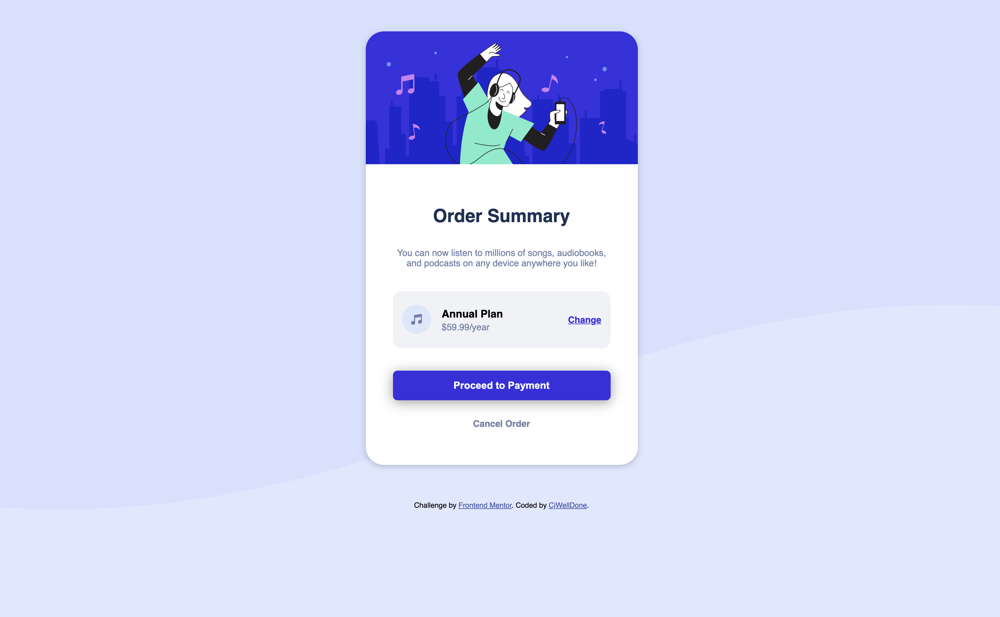

# Frontend Mentor - Order summary card solution

This is a solution to the [Order summary card challenge on Frontend Mentor](https://www.frontendmentor.io/challenges/order-summary-component-QlPmajDUj). Frontend Mentor challenges help you improve your coding skills by building realistic projects. 

## Table of contents

- [Overview](#overview)
  - [The challenge](#the-challenge)
  - [Screenshot](#screenshot)
  - [Links](#links)
- [My process](#my-process)
  - [Built with](#built-with)
  - [What I learned](#what-i-learned)
  - [Continued development](#continued-development)
  - [Useful resources](#useful-resources)
- [Author](#author)

**Note: Delete this note and update the table of contents based on what sections you keep.**

## Overview

### The challenge

Users should be able to:

- See hover states for interactive elements

### Screenshot

### Links

- Solution URL: [https://cjwelldone.github.io/frontendmentor_order_summary_component_ch/](https://cjwelldone.github.io/frontendmentor_order_summary_component_ch/)

## My process

### Built with

- HTML5
- Flexbox
- SASS

### What I learned

Learned more about flexbox and using SASS.

### Continued development

Will dive deeper into Sass and ScSS

### Useful resources

- [CSS-Tricks](https://css-tricks.com/) - This helped me for the Flexbox Part.

## Author

- Frontend Mentor - [@cjwelldone](https://www.frontendmentor.io/profile/cjwelldone)
